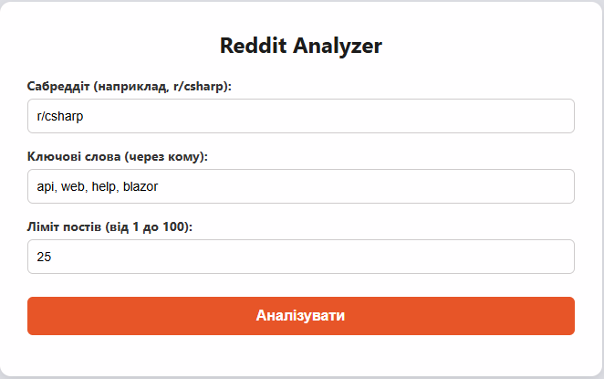
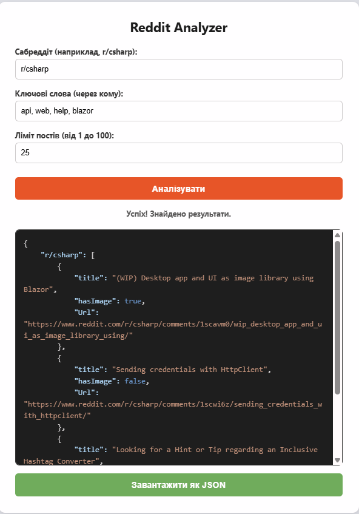

# Reddit Analyzer API

Цей проект — це Web API на базі .NET 10 для асинхронного парсингу, фільтрації та аналізу постів із платформи Reddit.



### Реалізовані додаткові вимоги:
* **Багатопоточність:** Використання `Task.WhenAll` для паралельного завантаження даних із кількох сабреддітів одночасно.
* **Глибока фільтрація:** Пошук ключових слів здійснюється як у заголовку (`title`), так і в самому тексті поста (`selftext`).
* **Детекція медіа:** Додано поле `HasImage`, яке визначає, чи містить пост прикріплене зображення.
* **Генерація файлу:** API вміє повертати результат у вигляді готового до завантаження `.json` файлу.
* **Графічний UI:** Реалізовано веб-інтерфейс для зручного введення даних, перегляду відформатованого результату та скачування файлу.
* **Обробка помилок:** Глобальний перехоплювач помилок у контролері та обробка `HttpRequestException` для захисту від падінь при невалідних URL.

---

### Клонування репозиторію

Спочатку завантажте проект на свій комп'ютер:
```bash
git clone https://github.com/SashaVolo/RedditAnalyzerAPI.git
cd RedditAnalyzerAPI
```


## 🛠 Інструкція запуску

Проект повністю контейнеризований і не вимагає встановлення .NET SDK на вашому комп'ютері.

1. Переконайтеся, що у вас встановлений та запущений **Docker**.
2. Відкрийте термінал у кореневій папці проекту (там, де знаходиться `Dockerfile`).
3. Зберіть Docker-образ (використовується багатоетапна збірка для мінімізації розміру):
```bash
docker build -t reddit-analyzer .
```
4. Запустіть контейнер:
```bash
docker run -d -p 8080:8080 --name analyzer-api reddit-analyzer
```

**Точки доступу після запуску:**
* **Web UI (Інтерфейс користувача):** [http://localhost:8080/](http://localhost:8080/)
* **Swagger (Документація API):** [http://localhost:8080/swagger](http://localhost:8080/swagger)

---

## Очищення ресурсів

Якщо ви запускали проект через Docker і хочете видалити контейнер після перевірки:
```bash
# Зупинити та видалити контейнер
docker stop analyzer-api
docker rm analyzer-api

# Видалити образ (опціонально)
docker rmi reddit-analyzer
```
---

## Опис використання

Взаємодіяти з додатком можна двома способами:

**Спосіб 1: Через Web UI**
Перейдіть за адресою `http://localhost:8080/`, введіть назву сабреддіта, ключові слова через кому та ліміт постів. Натисніть "Аналізувати". Результат відобразиться на екрані з підсвічуванням синтаксису, після чого його можна буде завантажити як файл.



**Спосіб 2: Прямий API виклик (REST)**
Відправте `POST` запит на ендпоінт `/api/redditanalyzer` із необхідним JSON-тілом.

---

## Приклад запиту

**Endpoint:** `POST /api/redditanalyzer`  
**Headers:** `Content-Type: application/json`

**Тіло запиту (Request Body):**
```json
{
  "items": [
    {
      "subreddit": "r/csharp",
      "keywords": ["api", "web", "dotnet", "help"]
    },
    {
      "subreddit": "r/math",
      "keywords": ["geometry", "theorem", "algebra"]
    }
  ],
  "limit": 50
}
```

---

## Теоретичне питання

**Питання:** *Які проблеми можуть виникнути при такому підході до отримання даних із веб-сторінок (через НТТР + парсинг HTML)? Як би ви їх вирішували?*

**Відповідь:**
При класичному парсингу HTML-коду (Web Scraping) виникає кілька критичних проблем:

1. **Динамічний контент (SPA):** Більшість сучасних сайтів (включно з Reddit) генерують контент на стороні клієнта за допомогою JavaScript (React, Angular, Vue). Звичайний HTTP GET-запит поверне лише порожній скелет HTML-сторінки без корисних даних.

2. **Захист від ботів (Rate Limiting & CAPTCHA):** Сайти активно блокують скрипти, які роблять забагато запитів з однієї IP-адреси, не мають правильних HTTP-заголовків (`User-Agent`, `Cookies`) або не виконують JS-челенджі (наприклад, Cloudflare).

**Шляхи вирішення:**
1. **Пошук прихованого або публічного API (Найкращий варіант):** Замість парсингу HTML слід проаналізувати мережеві запити в DevTools браузера і знайти JSON-ендпоінти, до яких звертається сам сайт. У цьому проекті використано саме цей підхід (додавання `.json` до URL сабреддіта), що забезпечує стабільність.
2. **Обхід блокувань:** Налаштування ротації Proxy-серверів, підміна `User-Agent` на реалістичні (браузерні) та встановлення випадкових затримок (Delay) між запитами для імітації поведінки живої людини.

---

## Структура проекту

Проект побудований за принципом розділення відповідальності (Separation of Concerns):

* **📁 Controllers/** — містить `RedditAnalyzerController`. Відповідає за обробку вхідних HTTP-запитів, валідацію та повернення файлів.
* **📁 Services/** — серце додатку. Тут знаходиться `RedditAnalyzerService`, який виконує асинхронні запити до Reddit та фільтрує дані.
* **📁 Dtos/** — опис структур даних (`Request`, `Response`, `RedditPost`), які використовуються для передачі інформації.
* **📁 RedditModels/** — містить внутрішні моделі для десеріалізації (перетворення) сирої JSON-відповіді від Reddit API:
    * `RedditPostDto.cs` — технічний об'єкт, який точно повторює структуру оригінального поста Reddit. Використання окремих моделей для стороннього API дозволяє ізолювати зовнішні зміни від нашої внутрішньої логіки.
* **📁 wwwroot/** — фронтенд частина. Містить `index.html` з логікою підсвічування JSON та візуалізацією результатів.
* **📁 Logs/** — автоматично створена папка, де зберігаються логи роботи додатку (Serilog).
* **📄 Program.cs** — точка входу, де налаштовується DI-контейнер, логування та Middleware для статики.
* **📄 Dockerfile** — конфігурація для багатоетапної збірки легковажного образу.

---

## 🛠 Технологічний стек

* **Backend:** .NET 10, C#, ASP.NET Core Web API.
* **Logging:** Serilog (запис у консоль та файл).
* **Documentation:** Swagger / OpenAPI.
* **Frontend:** HTML5, CSS3 (Reddit style), JavaScript (Vanilla).
* **Containerization:** Docker (Alpine/Debian-based runtime).

---

## Архітектурні рішення

1.  **Dependency Injection (DI):** Сервіс аналізу впроваджується через інтерфейс `IRedditAnalyzerService`, що дозволяє легко замінити логіку парсингу або написати Unit-тести.
2.  **Асинхронність (Async/Await):** Весь ланцюжок від контролера до мережевого запиту є асинхронним, що дозволяє серверу не блокувати потоки під час очікування відповіді від Reddit.
3.  **In-Memory Processing:** Дані обробляються "на льоту" без використання проміжної бази даних, що забезпечує високу швидкість роботи.
4.  **Static Files Middleware:** Проект налаштований так, щоб самостійно роздавати свій UI, що робить його повністю автономним усередині контейнера.


